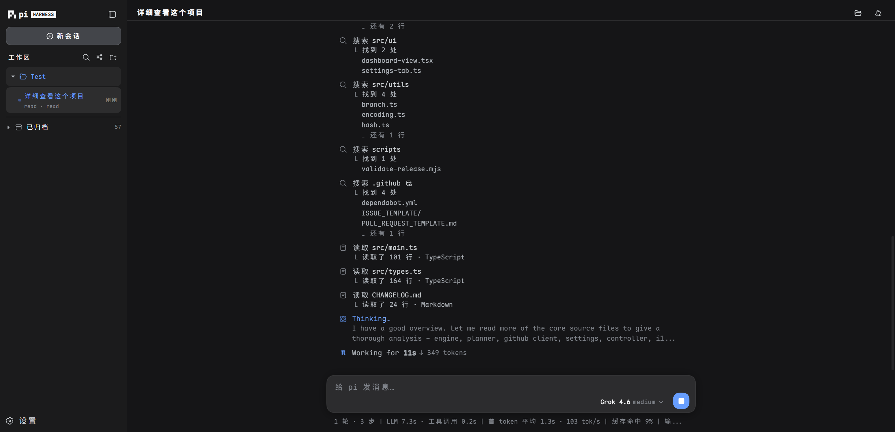

# PiWeb

<p align="center">
  <strong>A modern web UI for the Pi Coding Agent.</strong>
</p>

<p align="center">
  <strong>English</strong> | <a href="README_zh.md">简体中文</a>
</p>

<p align="center">
  
</p>

---

**PiWeb** brings a sleek, feature-rich browser interface to the [pi coding agent](https://github.com/earendil-works/pi) with zero modifications to the core Pi engine. Install with one command, and all your existing pi configuration, sessions, models, skills, and plugins work out of the box.

## Features

### Real-Time Streaming Chat

Full SSE snapshots with ordered deltas and automatic replay via `Last-Event-ID`. The thinking process and inline tool execution cards stream live.

<p align="center"></p>

### Workspaces & Sessions

Sessions grouped by project folder, with a native folder picker (Windows / macOS / Linux), rename and archive. Session tree branches, draft recovery, and JSONL / HTML export.

### Import Local Sessions

Bring conversation history from Codex, Claude Code, Grok, ZCode, dsh, and opencode on this machine into pi sessions without loss: text, thinking, tool calls and their results, timestamps, and usage are all kept, and the source data is **read-only** — nothing in the other tools is modified. If the original project directory still exists locally the session lands in that workspace; otherwise it falls back to one you pick. Find it under Settings → Import sessions. The 15 most recent conversations per source are listed, and anything already imported is marked and cannot be imported twice.

### Project Growth Tree

Every step the agent takes on your codebase is snapshotted: navigate the timeline round by round, see added/modified/deleted files, and open line-level diffs for any file at any step — even if the workspace has no git history of its own.

### Context Meter

Click the ring next to the composer to see the context window broken down into 13 segments — System Prompt, System/Custom Tools, Memory (AGENTS.md), Skills, messages by type, Compacted Data, Auto-Compact Buffer, and Free Space.

### Model & Provider Management

30+ built-in providers, OAuth logins (Claude, Codex, Copilot, etc.), custom providers written to `models.json`, one-click model discovery, and a placeholder key auto-filled for local gateways like Ollama.

### Plugins & Skills

Install, update, and uninstall pi packages directly from the UI. Enable/disable or delete skills; every change applies to running sessions immediately.

### Security

Optional login via `PI_WEB_PASSWORD` (required for non-loopback binds), origin validation on write actions, strict path boundary checks, and tool presets (Read Only / Workspace Write / Full Access).

## Usage

### Install

```bash
npm install -g @rexvane/piweb
piweb
```

The package registers only the `piweb` command, so it never conflicts with the official `pi` CLI. Requires Node.js ≥ 22.19.0 (24 recommended); Git is needed for growth-history features.

### Update

```bash
npm install -g @rexvane/piweb@latest
```

npm replaces the installed version in place, so there is nothing to uninstall first. This is
the same command the in-app "Check for updates" button runs. `latest` is npm's default tag,
so `npm install -g @rexvane/piweb` behaves identically; if your registry is a mirror that
syncs with a delay, add `--registry=https://registry.npmjs.org` to get a release the moment
it is published. Restart `piweb` afterwards to serve the new version.

Or install a specific version: `npm install -g @rexvane/piweb@0.3.4`.

### Uninstall

```bash
npm uninstall -g @rexvane/piweb
```

This removes PiWeb only — your pi data lives in `~/.pi/agent/` and is left untouched.

### Run

```bash
piweb                    # http://127.0.0.1:30141 (auto-increments if busy)
piweb -p 30143 --no-open # custom port, don't open the browser
piweb -H 0.0.0.0         # LAN access (requires PI_WEB_PASSWORD)
```

| Option | Description |
| --- | --- |
| `-p, --port <port>` | Listen port (default 30141, env `PORT`) |
| `-H, --hostname <host>` | Bind address (default 127.0.0.1, env `PI_WEB_HOSTNAME`) |
| `--dev` | Development mode |
| `--no-open` | Do not auto-open the browser |

Set `PI_WEB_PASSWORD` to enable the login page and HTTP Basic Auth (user `pi`). Remote access over plain HTTP is not recommended; use HTTPS or a trusted VPN.

## License

[MIT](LICENSE)
