# PiWeb

<p align="center">
  <strong>A modern web UI for the Pi Coding Agent.</strong>
</p>

<p align="center">
  <strong>English</strong> | <a href="README_zh.md">简体中文</a>
</p>

<p align="center">
  
</p>

---

**PiWeb** brings a sleek, feature-rich browser interface to the [pi coding agent](https://github.com/earendil-works/pi) with zero modifications to the core Pi engine. Install with one command, and all your existing pi configuration, sessions, models, skills, and plugins work out of the box.

## Relationship to pi

PiWeb and pi are two separate programs, and PiWeb is not another build of pi: it is a web shell that drives the pi already installed on your machine through the official SDK, leaving pi itself untouched. The two **share one set of state** — the same agent directory (`~/.pi/agent`) holds your settings, models and credentials, sessions, skills and packages — so a conversation started in the pi CLI shows up in the browser right away, and the other way round. Updating is **two separate things**: the pi engine and PiWeb each carry their own version and their own update entry point (the two "Check for updates" rows in Settings), and upgrading one leaves the other alone. What runs underneath is native pi; plugin compatibility in the browser, interactive plugins especially, is not finished yet — for now plugins can be managed rather than fully driven from the page.

## Workflows and Delegation

Use the **+** button in the composer's lower-left corner to choose **Agent / Plan / Goal** per session. Agent uses the existing tool preset. Plan uses read-only tools and stops for explicit approval; "Execute plan" temporarily restores the current tool preset for that run, then returns to read-only planning. Goal retains the first prompt as the objective and asks the agent to verify progress on later turns; it does not start unlimited follow-up turns automatically. Workflow state is stored as a custom entry in the native pi session.

Plan's tool restriction is not a sandbox for locally installed, trusted pi extensions. Approval is tied to the latest proposed plan and is rejected if the conversation changes after that plan.

Click a sent user message to edit and resend it in place, even without changing its text. PiWeb reruns the conversation from that message and keeps the previous branch in the native session history rather than adding a new message at the bottom.

With the standard or full tool preset, `piweb_delegate` can run up to three independent research tasks in parallel. Each temporary subagent uses the current model and read-only file tools. It cannot run commands, edit files, or delegate again. Reports return to the parent; these are not independent Worker sessions. The explicit read-only preset does not automatically enable delegation.

## Features

### Real-Time Streaming Chat

Markdown renders as it streams — headings, lists and code blocks take shape before the answer is finished, not after. Thinking and tool calls appear inline as cards. The layout stays restrained: sessions on the left, outline on the right, both collapsible, leaving the screen to the conversation.

<p align="center"></p>

### Chat Navigation

The outline on the right of the transcript: **bold entries are messages you sent**, the rest are headings inside the assistant's answers. Collapsed it reads as a column of bars — longer for your messages, shorter the deeper a heading sits; hover to expand the list. It highlights where you are as you scroll, and a click scrolls smoothly to that spot.

<p align="center">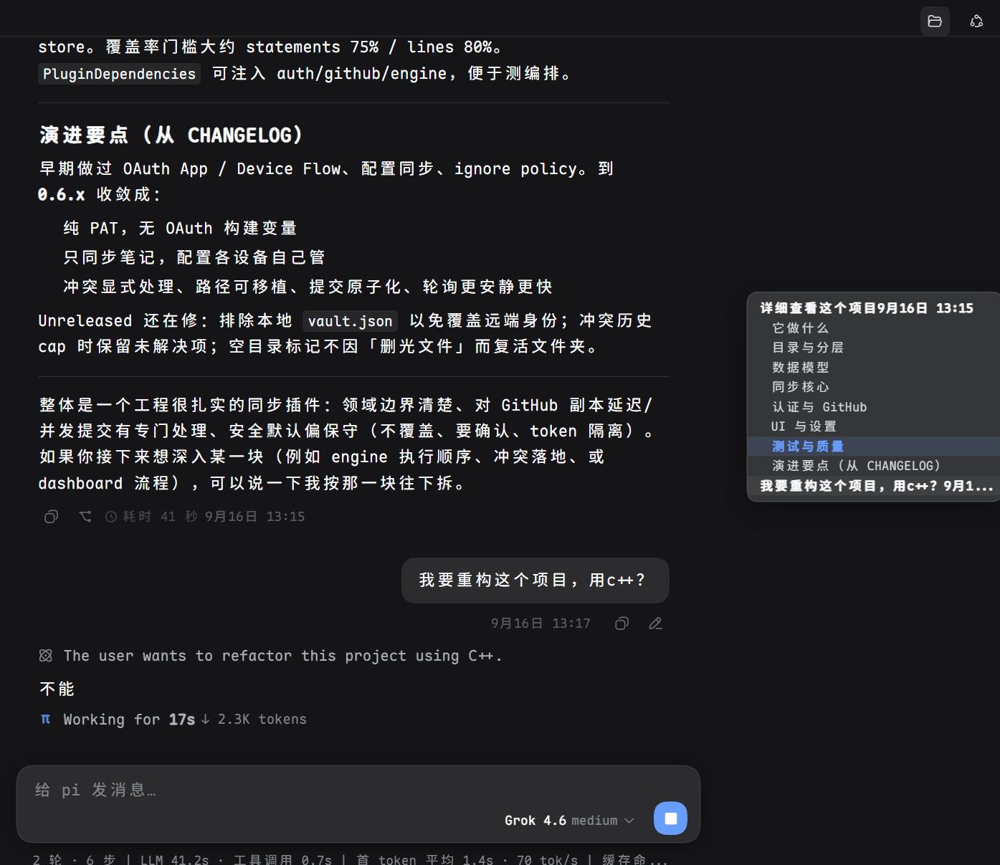</p>

### Trajectory and Files, In Place

Tool cards carry both entry points: **View in trajectory** drops that step into the trajectory panel — a timeline with input / model / tool lanes, laid out by sequence, wall-clock time or duration, searchable, with per-row tokens and timings and detail tabs for summary, preview, raw and source. **Open in editor** jumps straight to the local file that step touched. A card that changed a file also carries the whole diff inline (additions green, deletions red, with +N −M counts), folded to a preview for long changes and expanded on click.

<p align="center">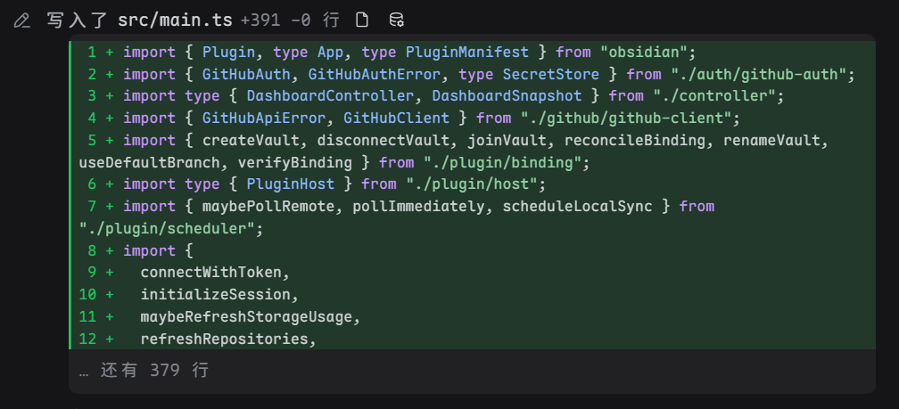</p>
<p align="center">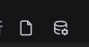 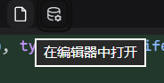 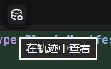</p>

### Workspaces & Sessions

Sessions grouped by project folder, with a native folder picker (Windows / macOS / Linux), rename and archive. Archived conversations live together under "Archived" in the sidebar, ready to reopen or unarchive, and **an archived session is deleted automatically after 30 days of inactivity** — no manual cleanup. Session tree branches, draft recovery, and JSONL / HTML export are there too.

<p align="center">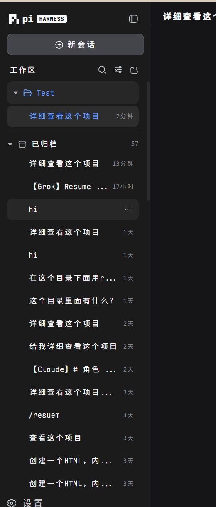</p>

### Import Local Sessions

Bring conversation history from Codex, Claude Code, Grok, ZCode, dsh and opencode on this machine into pi sessions without loss: text, thinking, tool calls and their results, timestamps and usage are all kept, and the source data is **read-only** — nothing in the other tools is modified. Each source lists only its 15 most recent **main** conversations; work the main agent handed to a subagent is ignored, because the conversation you want is your own. If the original project directory still exists locally the session lands in that workspace, otherwise it falls back to one you pick — and anything already imported is marked and never imported twice.

<p align="center">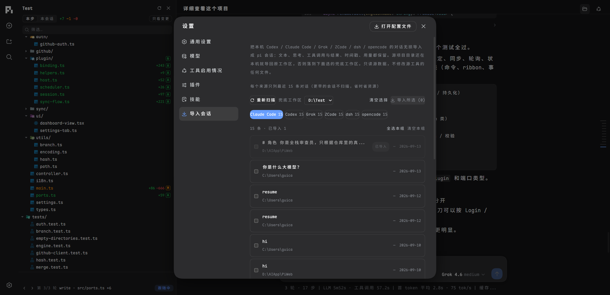</p>

### Project Growth Tree

Every file operation pi makes is snapshotted, grouped one round per message you send. Each round shows what changed **relative to the previous one** — files added, modified and deleted, with line-level diffs one click away — so you can review the work round by round, or drill into single steps inside a round. A round with no file changes says so instead of being skipped, and the record is independent of git: it works on a project with no version history at all.

<p align="center">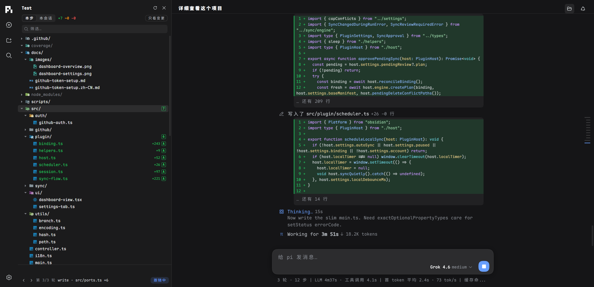</p>
<p align="center">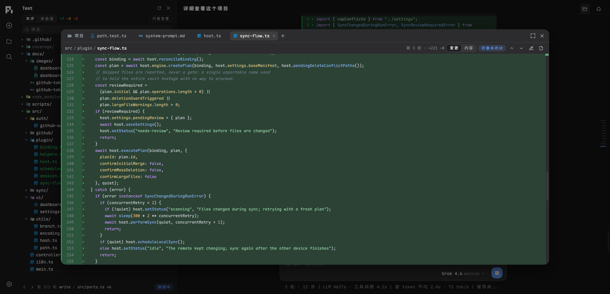</p>

### File Viewer

Open project files in the page instead of switching to an editor: a centered window with tabs, and fuzzy search behind the "+". Each file has three views — **Changes** (whole-file diff, additions green and deletions red, with one-click jumps between changes), **Content** (line numbers and syntax highlighting; deleted files show their last content), and **Rendered** (Markdown as a document). Quote a selection into the composer, or open the file in your local editor.

<p align="center">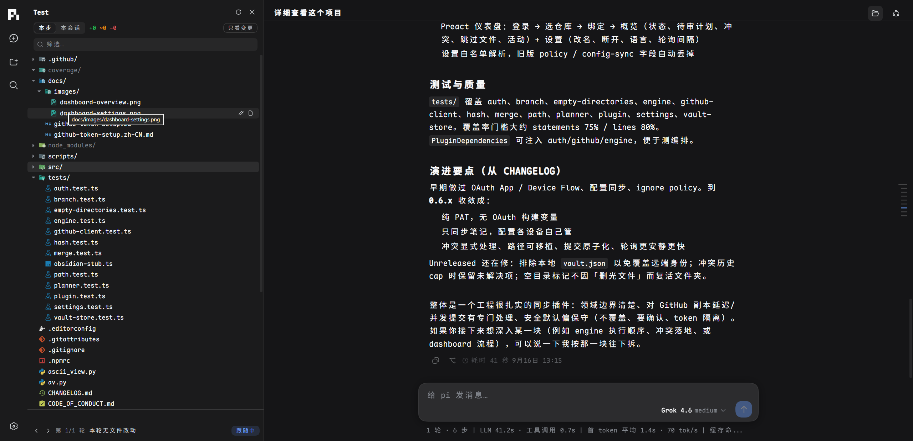</p>
<p align="center">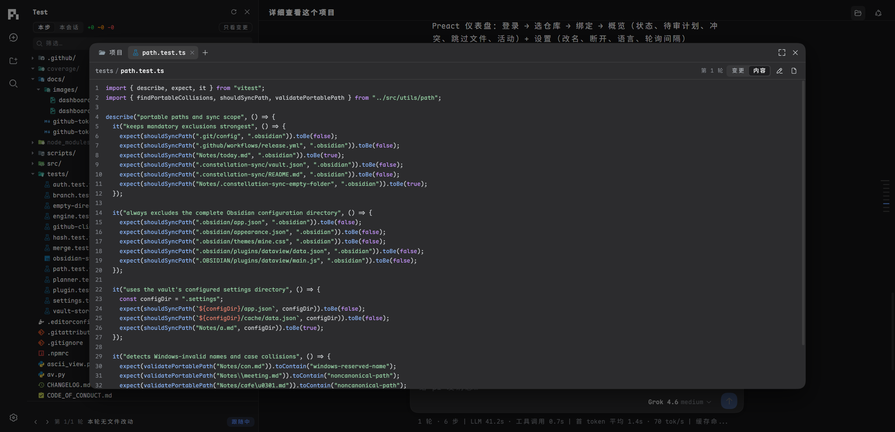</p>

### Context Meter

Click the ring next to the composer to see the context window broken down into 13 segments — System Prompt, System/Custom Tools, Memory (AGENTS.md), Skills, messages by type, Compacted Data, Auto-Compact Buffer, and Free Space.

### Prompt Sources

A header button opens a panel listing every prompt that reaches the model's context: the system prompt and its appended sections, project memory (`AGENTS.md`), each skill's `SKILL.md`, prompt templates, tool definitions, plus the assembled prompt actually sent and the compaction summary — each row labelled with where it came from (project / personal / package / extension). Click a row to read the original in the centre viewer. The list is enumerated live for the current workspace, so prompts that arrive with a plugin or package installed later show up on refresh.

<p align="center">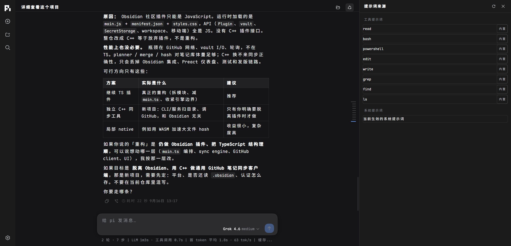</p>
<p align="center">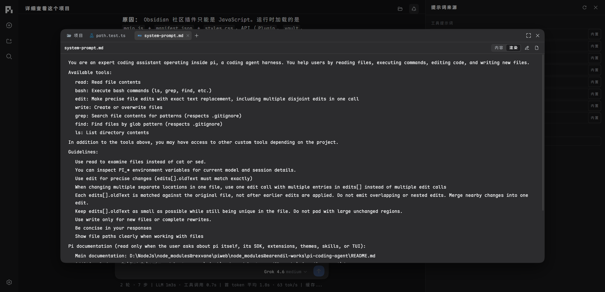</p>

### Model & Provider Management

40 built-in providers, signed in with an API key or OAuth — Anthropic, GitHub Copilot, OpenAI Codex, xAI, OpenRouter, Kimi and Radius support one-click OAuth. Anything else works just as well: give a custom provider its base URL, protocol and models, and it lands in `models.json`; local gateways such as Ollama get a placeholder key automatically. Pull the model catalog in one click, and quota or balance reads (Claude, Codex, xAI, DeepSeek and 7 more) sit right on the provider card.

<p align="center">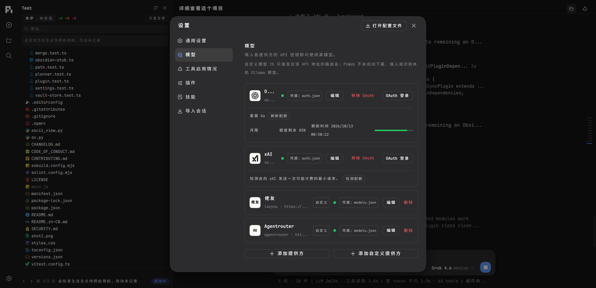</p>
<p align="center">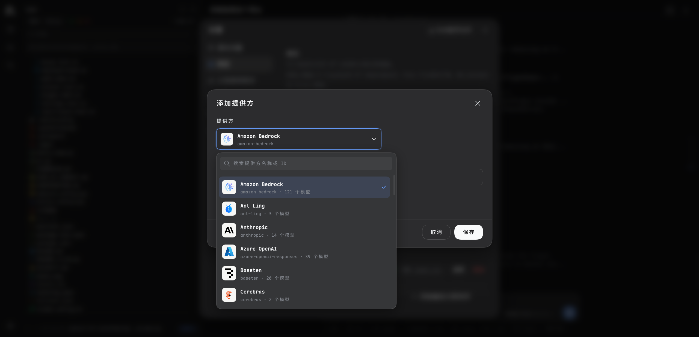</p>
<p align="center">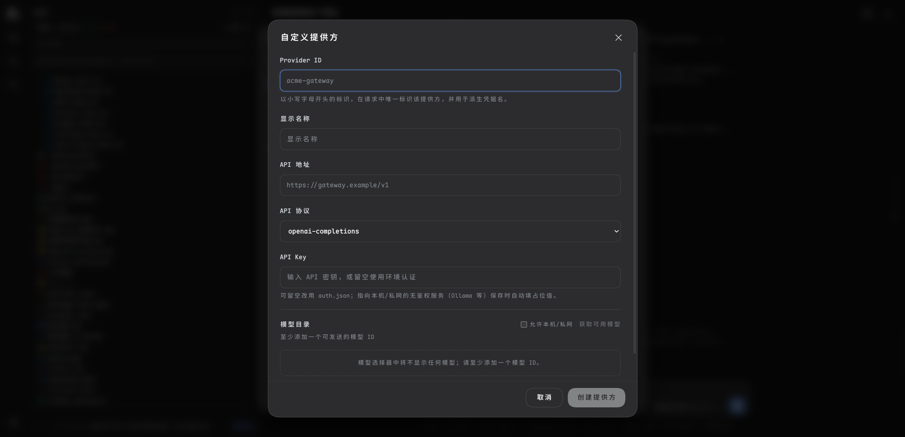</p>

### Plugins & Skills

Install, update, and uninstall pi packages directly from the UI. Enable/disable or delete skills; every change applies to running sessions immediately.

### Security

Optional login via `PI_WEB_PASSWORD` (required for non-loopback binds), origin validation on write actions, strict path boundary checks, and tool presets (Read Only / Workspace Write / Full Access).

## Usage

### Install

```bash
npm install -g @rexvane/piweb
piweb
```

The package registers only the `piweb` command, so it never conflicts with the official `pi` CLI. Requires Node.js ≥ 22.19.0 (24 recommended); Git is needed for growth-history features.

On Windows x64 and ARM64, npm automatically installs PiWeb's matching managed [niubash](https://github.com/unixwin/niubash) portable runtime. PiWeb uses it as the `bash` tool through the official Pi SDK—no separate shell install and no changes to `~/.pi/agent/settings.json`. macOS and Linux continue to use Pi's normal system Bash selection. If the optional Windows runtime is omitted or fails integrity validation, PiWeb logs a warning and falls back to Pi's configured/default Bash.

### Update

```bash
npm install -g @rexvane/piweb@latest
```

npm replaces the installed version in place, so there is nothing to uninstall first. This is
the same command the in-app "Check for updates" button runs. `latest` is npm's default tag,
so `npm install -g @rexvane/piweb` behaves identically; if your registry is a mirror that
syncs with a delay, add `--registry=https://registry.npmjs.org` to get a release the moment
it is published. Restart `piweb` afterwards to serve the new version.

Or install a specific version: `npm install -g @rexvane/piweb@0.3.4`.

### Uninstall

```bash
npm uninstall -g @rexvane/piweb
```

This removes PiWeb only — your pi data lives in `~/.pi/agent/` and is left untouched.

### Run

```bash
piweb                    # http://127.0.0.1:30141 (auto-increments if busy)
piweb -p 30143 --no-open # custom port, don't open the browser
piweb -H 0.0.0.0         # LAN access (requires PI_WEB_PASSWORD)
```

| Option | Description |
| --- | --- |
| `-p, --port <port>` | Listen port (default 30141, env `PORT`) |
| `-H, --hostname <host>` | Bind address (default 127.0.0.1, env `PI_WEB_HOSTNAME`) |
| `--dev` | Development mode |
| `--no-open` | Do not auto-open the browser |

Set `PI_WEB_PASSWORD` to enable the login page and HTTP Basic Auth (user `pi`). Remote access over plain HTTP is not recommended; use HTTPS or a trusted VPN.

## License

[MIT](LICENSE). The optional Windows runtime packages redistribute niubash, rubash, and WinuxCmd under their upstream licenses; the pinned notices are in [`third-party/managed-niubash`](third-party/managed-niubash).
