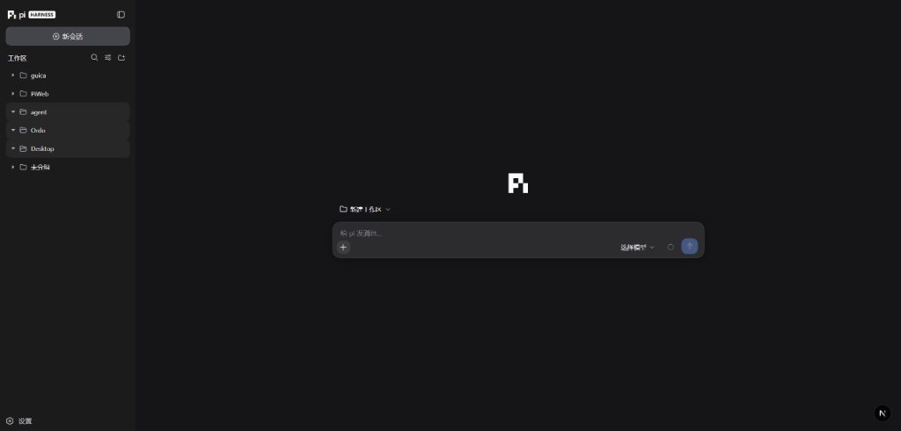

# PiWeb

<p align="center">
  <strong>为 Pi 编程智能体打造的现代 Web 界面 —— 对齐 DeepSeek Harness (dsh) 交互体验。</strong>
</p>

<p align="center">
  <a href="README.md">English</a> | <strong>简体中文</strong>
</p>

<p align="center">
  
</p>

---

**PiWeb** 是为 [pi 编程智能体](https://github.com/earendil-works/pi) 打造的 **dsh 式** 现代 Web 界面：`npm start` 一键启动，提供实时流式对话、工作区会话管理、会话树分支跳转、技能/插件/模型管理，**pi 本身零改动**。

- **引擎**：官方 npm 包 `@earendil-works/pi-coding-agent`（进程内 SDK），使用精确版本锁；`npm run update:pi` 独立升级和验证上游引擎。
- **界面**：视觉与交互对齐 [deepseek-harness (dsh)](https://github.com/deepseek-ai/deepseek-harness) Web 端 —— `--dsw-*` 实色面板、三栏框架（侧栏可收起为 56px 导轨 + 拖拽调宽）、22px 输入卡、ic_ds 图标与 π 官方图标。
- **原则**：工具、模型、技能和插件机制完全使用 Pi 官方原生方案；会话与工作区结构保持兼容。

## 功能亮点

- **实时流式交互**：SSE 完整快照 + 有序增量同步，支持 `Last-Event-ID` 断线补发，逐字平滑渲染；思考链（Thinking）与工具调用内联展示；多标签页 3 秒自动同步。
- **输入卡与控制**：支持图片附件（选择 / 粘贴 / 拖放）、两级模型选择与快速循环切换、上下文压缩、停止生成、清空队列及 `/` 斜杠命令面板（内置命令 + Pi 模板 + 技能）。
- **解耦的工作区与会话**：按项目文件夹分组展示，支持 Windows 原生文件夹选择器；支持空工作区独立留存；删除工作区弹出全局居中确认弹窗，文件夹与会话文件均安全保留并自动归集到“未分组”下。
- **会话管理**：支持导出会话日志为 JSONL / HTML、会话树分支可视化跳转与草稿恢复、AGENTS.md 上下文注入展示，以及轨迹性能视图（TTFT / 解码耗时）。
- **多功能设置**：
  - **通用**：工具权限预设（只读 / 工作区写入 / 完全访问）、中英双语切换、外观偏好、Enter 键行为、自动重试及自动压缩。
  - **模型**：支持 30+ 官方内置 Provider、添加自定义提供方（写入 `models.json`）及 OAuth 登录（Claude / Codex / Copilot 等）。
  - **插件与技能**：通过 Pi 原生包管理器安装、卸载、更新扩展，并支持即时开关 Skill。
- **安全防护**：可通过 `PI_WEB_PASSWORD` 开启 HTTP Basic Auth；写接口严格执行同源与路径边界校验。

## 快速开始

**环境要求**：Node.js ≥ 22。

### 通过 `pi web` 一键启动（推荐）

对齐 `dsh web` 启动方式，支持在任何终端中输入 `pi web`（支持任意大小写：`pi web`、`PI WEB`、`Pi Web`）启动 Web 界面：

```bash
# 全局注册 pi 与 piweb 命令（首次一次性执行）
npm link

# 任意终端直接启动（不区分大小写）
pi web
```

也可以直接通过 npm 启动：

```bash
# 启动服务（默认 http://127.0.0.1:30141，端口占用自动 +1，自动打开浏览器）
npm run web
# 或
npm start
```

### 命令行参数（bin/piweb.js）

```
-p, --port <port>      监听端口（默认 30141，env PORT；被占用自动 +1）
-H, --hostname <host>  绑定地址（默认 127.0.0.1，env PI_WEB_HOSTNAME）
--no-open              不自动打开浏览器（env PI_WEB_NO_OPEN=1）
-h, --help             帮助信息
```

### 开发与测试

```bash
npm run dev        # 启动热重载开发服务器
npm run typecheck  # TypeScript 类型检查
npm test           # Vitest 安全边界与协议测试
npm run check      # 完整流水线校验（类型 + 测试 + 生产构建）
```

## 架构

```
浏览器 (React 19 + Tailwind, src/components)
   │  REST 命令 (POST /api/agent/[id]) + SSE 事件流 (GET /api/agent/[id]/events)
   ▼
Next.js 服务端 (src/app/api, src/lib)
   ├─ agent-manager    AgentSession 池：惰性冷启动、事件翻译、空闲回收（10min/最多 6）
   ├─ session-reader   直读 ~/.pi/agent/sessions/**.jsonl（冷渲染不开 agent）
   ├─ trajectory       轨迹账本 + 服务端计时（TTFT/decode）
   ├─ skills/prompts   技能与 Prompt 模板发现 + SKILL.md frontmatter 开关
   ├─ models-service   模型目录/认证/OAuth 桥/models.json
   ├─ security-service 工具预设 + 项目信任
   ├─ plugins-service  pi 包安装/卸载/更新（DefaultPackageManager）+ 扩展清单
   ├─ workspace-store  手动添加的工作区（web-workspaces.json）+ 原生选文件夹
   ▼
@earendil-works/pi-coding-agent  (官方 SDK，pi 未修改)
```

## 开源协议

[MIT License](LICENSE)
