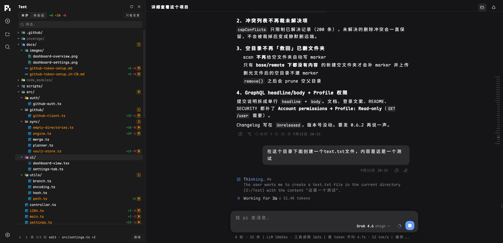
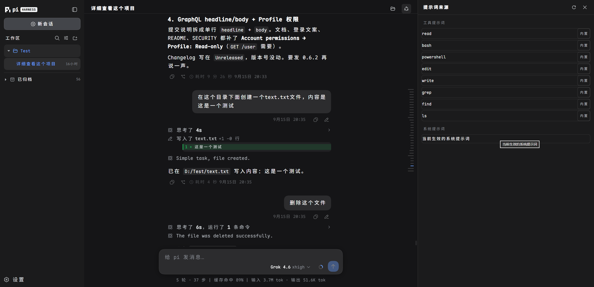
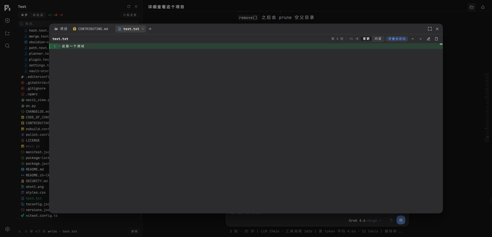
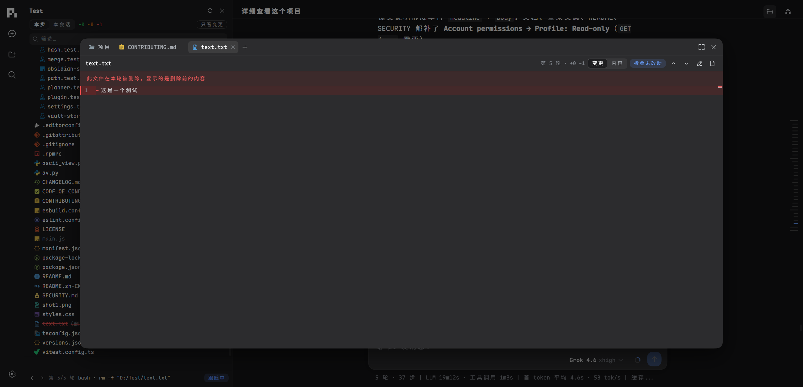

# PiWeb

<p align="center">
  <strong>为 Pi 编程智能体打造的现代 Web 界面。</strong>
</p>

<p align="center">
  <a href="README.md">English</a> | <strong>简体中文</strong>
</p>

<p align="center">
  
</p>

---

**PiWeb** 是为 [pi 编程智能体](https://github.com/earendil-works/pi) 打造的现代 Web 界面，**pi 引擎零改动**。一条命令安装，pi 已有的配置、会话、模型、技能和插件开箱即用。

## 特色功能

### 实时流式对话

SSE 完整快照 + 有序增量同步，支持 `Last-Event-ID` 断线补发；思考链（Thinking）与工具调用卡片内联实时展示。

<p align="center"></p>

### 工作区与会话

会话按项目文件夹分组，原生文件夹选择器（Windows / macOS / Linux），支持重命名与归档；会话树分支跳转、草稿恢复、JSONL / HTML 导出。

### 导入本地会话

把本机 Codex / Claude Code / Grok / ZCode / dsh / opencode 的历史对话无损导成 pi 会话：文本、思考、工具调用与结果、时间戳、用量都保留，源数据**只读**，不改动源工具的任何文件。源项目目录还在本机就导回原工作区，否则落到你选的兜底工作区。入口在「设置 → 导入会话」，每个来源默认只列最近 15 条，已导过的会被标记且不会重复导入。


### 项目生长树

智能体对代码库的每一步操作都会拍快照：按轮次导航时间轴，查看新增/修改/删除的文件，任意一步、任意文件的行级 diff 都能打开——即使项目本身没有 git 历史也能用。
<p align="center"></p>
<p align="center"></p>
<p align="center"></p>
<p align="center"></p>
### 上下文计量

点击输入框旁的圆环，上下文窗口拆成 13 段展示——System Prompt、System/Custom Tools、Memory（AGENTS.md）、Skills、各类消息、Compacted Data、Auto-Compact Buffer 与 Free Space。

### 模型与供应商管理

30+ 官方内置供应商，OAuth 登录（Claude / Codex / Copilot 等），自定义提供方写入 `models.json`，一键获取模型目录，本地网关（Ollama 等）自动填占位 Key。

### 插件与技能

在界面里直接安装、更新、卸载 pi 包；技能可启用/禁用/删除，改动即时作用于运行中的会话。

### 安全防护

可选 `PI_WEB_PASSWORD` 登录（对外监听必须设置）、写接口同源校验、严格路径边界检查、工具权限预设（只读 / 工作区写入 / 完全访问）。

## 使用

### 安装

```bash
npm install -g @rexvane/piweb
piweb
```

包只注册 `piweb` 一个命令，与官方 `pi` CLI 互不冲突。需要 Node.js ≥ 22.19.0（推荐 24）；生长树功能需要安装 Git。

### 更新

```bash
npm install -g @rexvane/piweb@latest
```

npm 会原地替换已安装的版本，不用先卸载。界面里的「检查更新」按钮执行的就是这条命令；
`latest` 是 npm 的默认标签，所以直接写 `npm install -g @rexvane/piweb` 效果完全一样。
如果你用的镜像是国内源、同步有延迟，可以加 `--registry=https://registry.npmjs.org`
当天就拿到新版本。装完重启 `piweb` 即可用上新版本。

也可以装指定版本：`npm install -g @rexvane/piweb@0.3.4`。

### 删除

```bash
npm uninstall -g @rexvane/piweb
```

只删除 PiWeb 本身——pi 的数据在 `~/.pi/agent/`，不会被动到。

### 启动

```bash
piweb                    # http://127.0.0.1:30141（端口占用自动 +1）
piweb -p 30143 --no-open # 自定义端口，不自动打开浏览器
piweb -H 0.0.0.0         # 局域网访问（必须设置 PI_WEB_PASSWORD）
```

| 参数 | 说明 |
| --- | --- |
| `-p, --port <port>` | 监听端口（默认 30141，env `PORT`） |
| `-H, --hostname <host>` | 绑定地址（默认 127.0.0.1，env `PI_WEB_HOSTNAME`） |
| `--dev` | 开发模式 |
| `--no-open` | 不自动打开浏览器 |

设置 `PI_WEB_PASSWORD` 开启登录页与 HTTP Basic Auth（用户名 `pi`）。远程访问不建议裸 HTTP，请使用 HTTPS 或可信 VPN。

## 开源协议

[MIT](LICENSE)
