# PiWeb

<p align="center">
  <strong>为 Pi 编程智能体打造的现代 Web 界面。</strong>
</p>

<p align="center">
  <a href="README.md">English</a> | <strong>简体中文</strong>
</p>

<p align="center">
  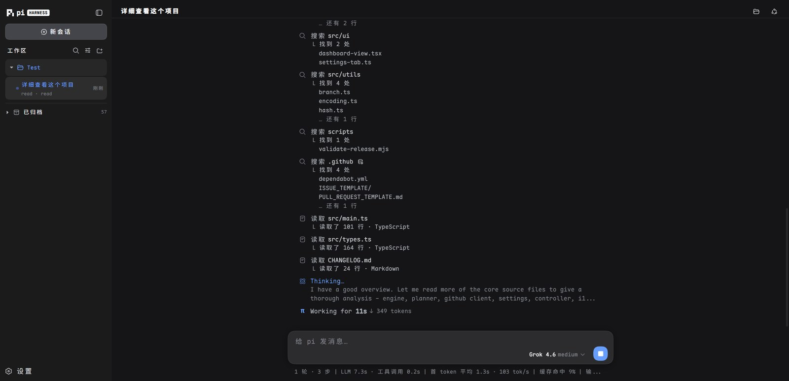
</p>

---

**PiWeb** 是为 [pi 编程智能体](https://github.com/earendil-works/pi) 打造的现代 Web 界面，**pi 引擎零改动**。一条命令安装，pi 已有的配置、会话、模型、技能和插件开箱即用。

## 与 pi 的关系

PiWeb 和 pi 是两个独立的程序，PiWeb 也不是 pi 的另一个版本：它是网页壳，通过官方 SDK 驱动你本机装好的 pi，不改动 pi 本体。两者**共用同一套配置**——同一个 agent 目录（`~/.pi/agent`）里放着设置、模型与凭据、会话、技能和包，所以在 pi CLI 里开的对话，网页里立刻能看到，反过来也一样。更新是**分开的**两件事：pi 内核和 PiWeb 各有版本、各有更新入口（设置里两个「检查更新」各管一个），升级哪个都不影响另一个。底层跑的就是原生 pi，插件在网页端的兼容（尤其是交互类插件）还没做完，目前以安装、卸载、启停为准。

## 特色功能

### 实时流式对话

边流边渲染 Markdown——标题、列表、代码块在回答还没写完时就已成形，不是整段结束才排版；思考过程与工具调用以卡片内联实时展示。版面克制：会话在左、大纲在右，两侧都可收起，屏幕留给对话本身。

<p align="center"></p>

### 对话导航

对话区右侧的大纲：**加粗的是你发过的消息**，其余是助手回答里的各级标题。收起时是一列长短不一的横线（标题层级越深越短），悬停展开成列表；滚动时自动高亮当前所在的位置，点一下平滑跳过去。

<p align="center">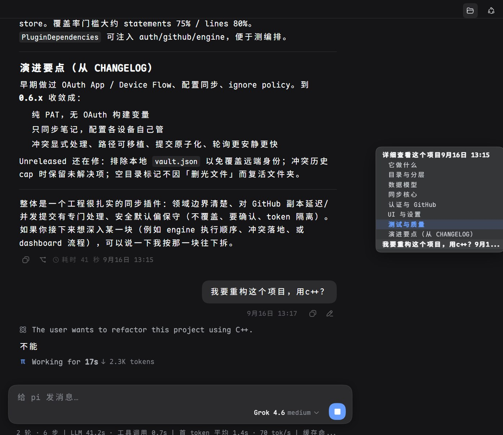</p>

### 工作区与会话

会话按项目文件夹分组，原生文件夹选择器（Windows / macOS / Linux），支持重命名与归档；归档的会话收在侧栏「已归档」里，随时查看或取消归档，**归档后 30 天没有活动就自动删除**，不用手动清理。另有会话树分支跳转、草稿恢复、JSONL / HTML 导出。

<p align="center">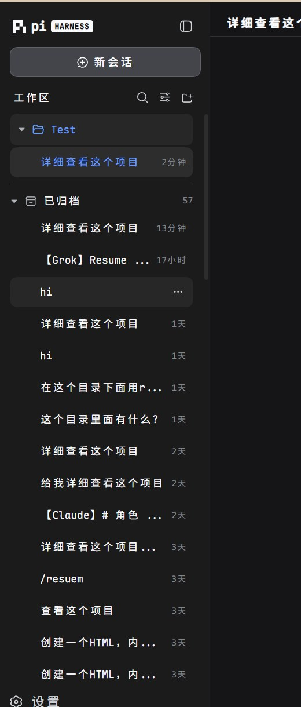</p>

### 导入本地会话

把本机 Codex / Claude Code / Grok / ZCode / dsh / opencode 的对话无损导成 pi 会话：文本、思考、工具调用与结果、时间戳、用量全部保留，源数据**只读**，不改动源工具的任何文件。每个来源只列最近 15 条**主会话**——主代理派给子代理的活自动忽略，你要的是自己那条对话。源项目目录还在本机就导回原工作区，否则落到你选的兜底工作区；已导过的会被标记，不会重复导入。

<p align="center">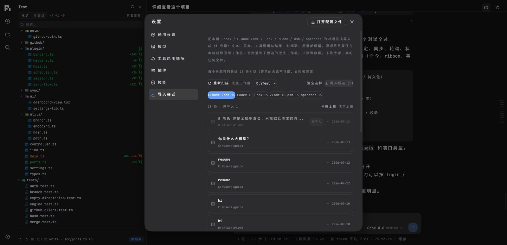</p>

### 项目生长树

pi 的每次文件操作都拍一张快照，按「你发一条消息 = 一轮」分组：每轮列出**相对上一轮**的新增 / 修改 / 删除，任意文件点开就是行级 diff，可以逐轮 review，也能在轮内按「步」细分到单次操作。没有文件改动的轮会注明，不会悄悄跳过；整棵记录独立于 git，项目本身没有版本历史也照样能用。

<p align="center">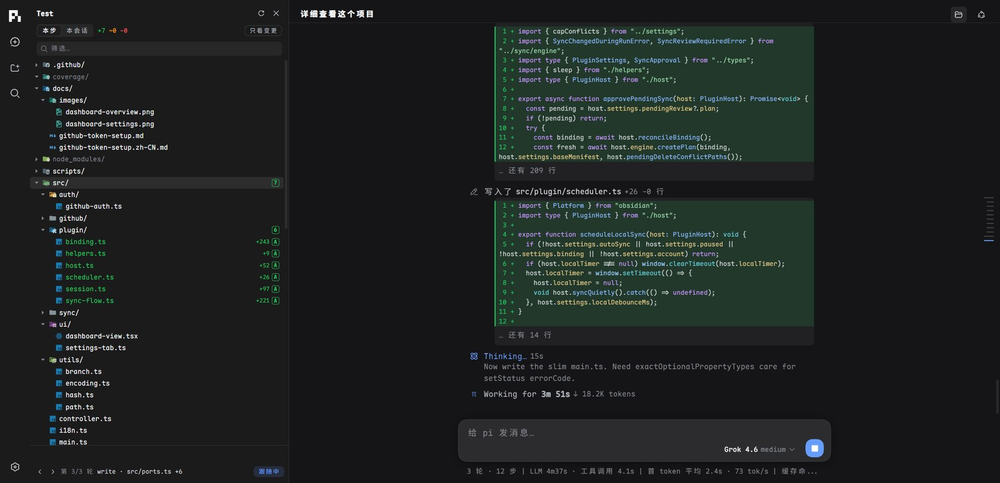</p>
<p align="center">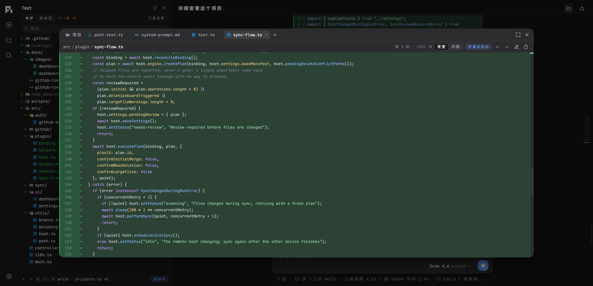</p>

### 文件查看器

项目文件在页面里直接打开，不必切编辑器：居中窗口、多标签页，`+` 模糊搜索找文件。同一个文件三种看法——**变更**（整文件 diff，新增绿、删除红，一键跳上一处 / 下一处改动）、**内容**（行号 + 语法高亮，被删文件显示删除前）、**渲染**（Markdown 直接成文）。看中的片段可引用进输入框，或用本地编辑器打开。

<p align="center">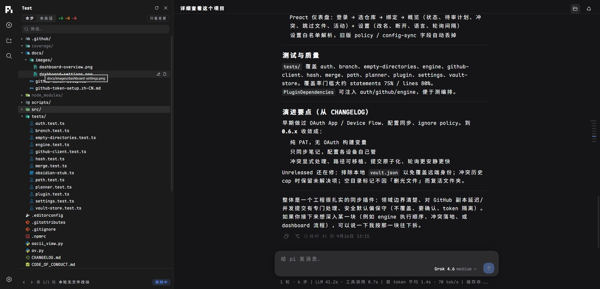</p>
<p align="center">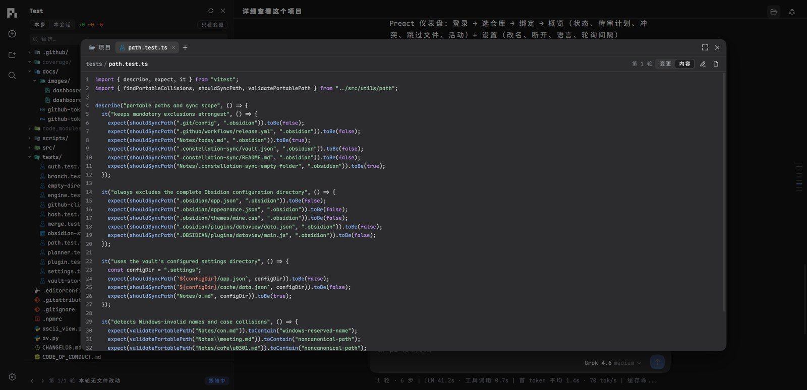</p>

### 上下文计量

点击输入框旁的圆环，上下文窗口拆成 13 段展示——System Prompt、System/Custom Tools、Memory（AGENTS.md）、Skills、各类消息、Compacted Data、Auto-Compact Buffer 与 Free Space。

### 提示词来源

顶栏按钮打开右侧面板，把进入模型上下文的提示词全部列出来：系统提示词与追加段、项目记忆 `AGENTS.md`、各技能的 `SKILL.md`、提示模板、工具定义，以及组装后实际发给模型的那一份与压缩摘要；每行标注来源（项目 / 个人 / 包 / 扩展）。点一行就在中间查看器里读原文。列表按当前工作区实时枚举，之后装的插件或包里带提示词，刷新即出现。

<p align="center">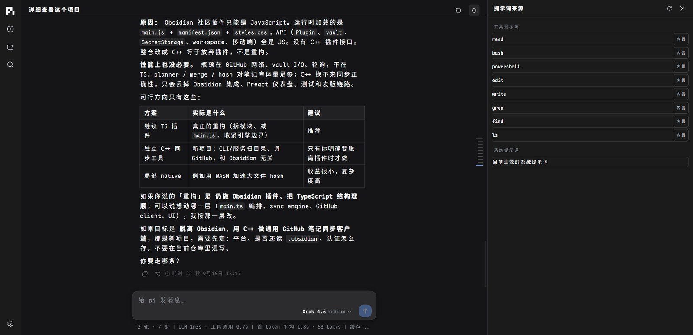</p>
<p align="center">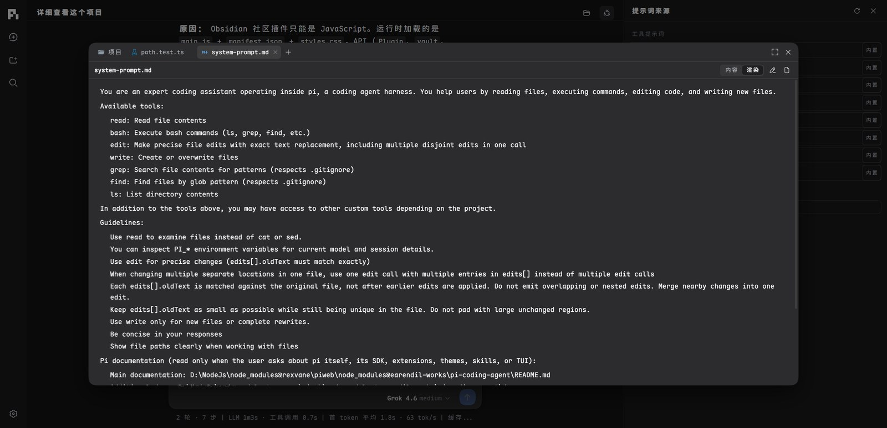</p>

### 模型与供应商管理

内置 40 家供应商，API Key 或 OAuth 授权登录都行——Anthropic、GitHub Copilot、OpenAI Codex、xAI、OpenRouter、Kimi、Radius 支持 OAuth 一键登录。名单之外的照样能用：自定义提供商填地址、协议与模型名即可，落进 `models.json`；本地网关（Ollama 等）自动补占位 Key。模型目录一键拉取，额度与余额（Claude / Codex / xAI / DeepSeek 等 11 家）直接显示在卡片里。

<p align="center">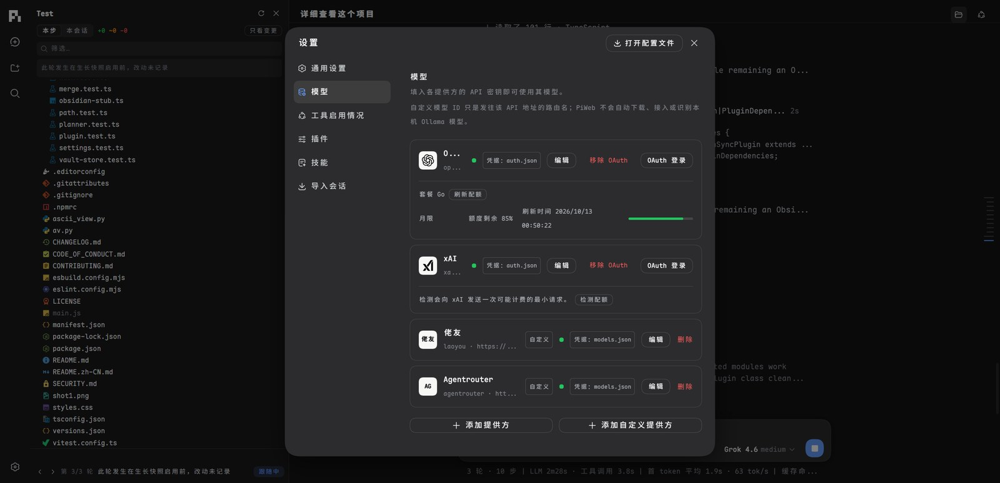</p>
<p align="center">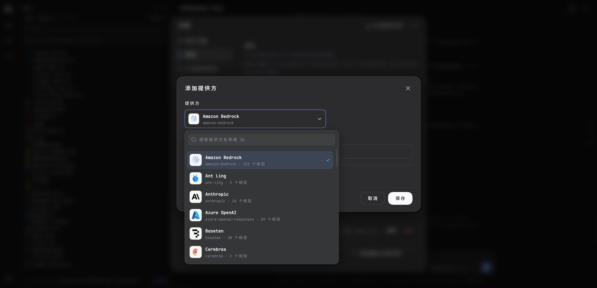</p>
<p align="center">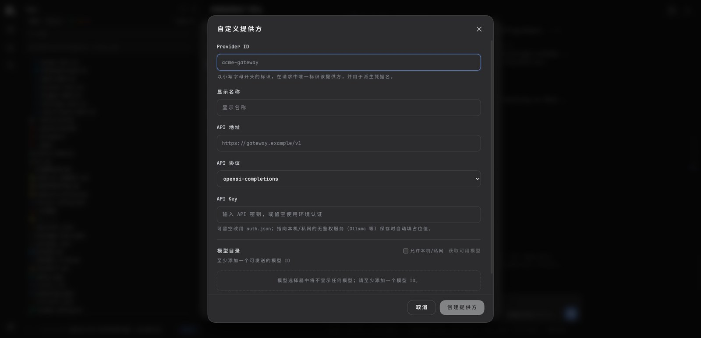</p>

### 插件与技能

在界面里直接安装、更新、卸载 pi 包；技能可启用/禁用/删除，改动即时作用于运行中的会话。

### 安全防护

可选 `PI_WEB_PASSWORD` 登录（对外监听必须设置）、写接口同源校验、严格路径边界检查、工具权限预设（只读 / 工作区写入 / 完全访问）。

## 使用

### 安装

```bash
npm install -g @rexvane/piweb
piweb
```

包只注册 `piweb` 一个命令，与官方 `pi` CLI 互不冲突。需要 Node.js ≥ 22.19.0（推荐 24）；生长树功能需要安装 Git。

### 更新

```bash
npm install -g @rexvane/piweb@latest
```

npm 会原地替换已安装的版本，不用先卸载。界面里的「检查更新」按钮执行的就是这条命令；
`latest` 是 npm 的默认标签，所以直接写 `npm install -g @rexvane/piweb` 效果完全一样。
如果你用的镜像是国内源、同步有延迟，可以加 `--registry=https://registry.npmjs.org`
当天就拿到新版本。装完重启 `piweb` 即可用上新版本。

也可以装指定版本：`npm install -g @rexvane/piweb@0.3.4`。

### 删除

```bash
npm uninstall -g @rexvane/piweb
```

只删除 PiWeb 本身——pi 的数据在 `~/.pi/agent/`，不会被动到。

### 启动

```bash
piweb                    # http://127.0.0.1:30141（端口占用自动 +1）
piweb -p 30143 --no-open # 自定义端口，不自动打开浏览器
piweb -H 0.0.0.0         # 局域网访问（必须设置 PI_WEB_PASSWORD）
```

| 参数 | 说明 |
| --- | --- |
| `-p, --port <port>` | 监听端口（默认 30141，env `PORT`） |
| `-H, --hostname <host>` | 绑定地址（默认 127.0.0.1，env `PI_WEB_HOSTNAME`） |
| `--dev` | 开发模式 |
| `--no-open` | 不自动打开浏览器 |

设置 `PI_WEB_PASSWORD` 开启登录页与 HTTP Basic Auth（用户名 `pi`）。远程访问不建议裸 HTTP，请使用 HTTPS 或可信 VPN。

## 开源协议

[MIT](LICENSE)
