# PiWeb

<p align="center">
  <strong>为 Pi 编程智能体打造的现代 Web 界面。</strong>
</p>

<p align="center">
  <a href="README.md">English</a> | <strong>简体中文</strong>
</p>

<p align="center">
  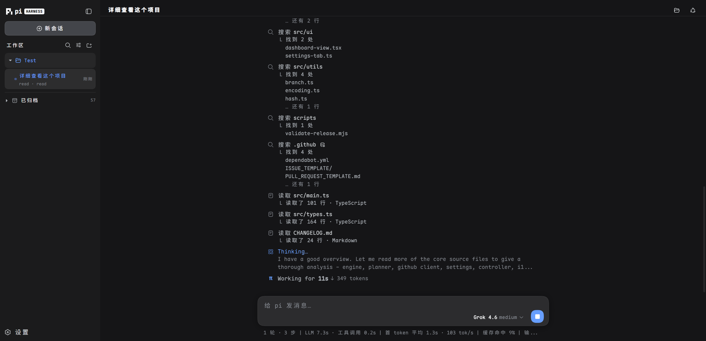
</p>

---

**PiWeb** 是为 [pi 编程智能体](https://github.com/earendil-works/pi) 打造的现代 Web 界面：`npm start` 一键启动，提供实时流式对话、工作区会话管理、会话树分支跳转、技能/插件/模型管理，**pi 本身零改动**。

- **引擎**：官方 npm 包 `@earendil-works/pi-coding-agent`（进程内 SDK），使用精确版本锁；`npm run update:pi` 独立升级和验证上游引擎。
- **界面**：`--dsw-*` 实色面板、三栏框架（侧栏可收起为 56px 导轨 + 拖拽调宽）、22px 输入卡与 π 官方图标。
- **原则**：工具、模型、技能和插件机制完全使用 Pi 官方原生方案；会话与工作区结构保持兼容。

## 功能亮点

### 实时流式对话

边生成边排版 Markdown：标题、列表、表格和代码块在回答写完之前就成形。思考过程和工具调用以卡片插在对话里。断线后用 `Last-Event-ID` 补发；多个标签页大约每 3 秒对齐一次。输入卡支持图片（选择、粘贴、拖放）、两级模型选择、上下文压缩、停止生成、清空队列，以及 `/` 命令（内置命令、Pi 模板、技能）。

<p align="center"></p>

### 对话导航

对话区右侧是大纲。加粗的是你发过的消息，其余是回答里的标题。收起时是一列长短不一的横线，标题越深越短；悬停展开成列表。滚动时高亮当前所在的位置，点一下跳过去。

<p align="center">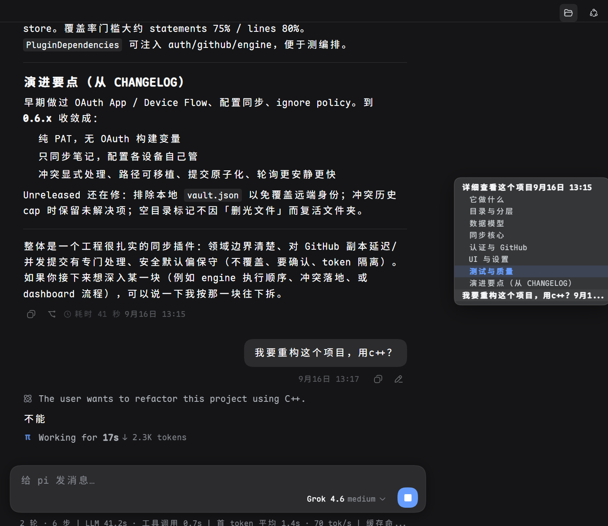</p>

### 对话里的轨迹与文件

改文件的工具卡片内联整段 diff，新增为绿、删除为红，并标出 +N −M。卡片上可以「在轨迹中查看」或「在编辑器中打开」。轨迹面板把这一步放进输入、模型、工具三条车道，可按等距、时间或间隔排布，详情分摘要、预览、原始、来源。已发送的消息可以原位编辑后重发，或撤回到这条消息之前；原分支仍留在会话文件里。

<p align="center">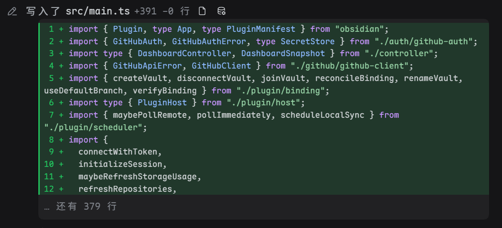</p>
<p align="center">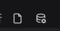 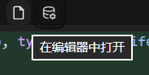 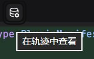</p>

### 工作区与会话

会话按项目文件夹分组，可用系统文件夹选择器添加工作区，空工作区可以单独留着。归档的会话收在侧栏「已归档」里，可以再打开或取消归档。会话能导出为 JSONL / HTML，也能沿会话树跳到别的分支。删掉一个工作区时，文件夹和会话文件都还在，会话归到「未分组」。

<p align="center">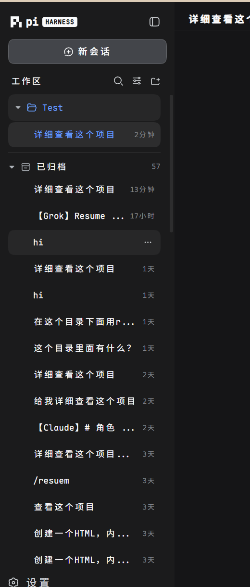</p>

### 项目生长：每轮一个 git commit

pi 每做完一轮，就把工作区提交一次到这个仓库自己的 `.git` 里，挂在 `refs/piweb/rounds/<key>`，不碰你的分支、HEAD 和暂存区。项目栏按轮列出这一轮相对上一轮改了哪些文件、各多少行，点开是这一轮的 diff。两轮之间你自己的修改单独记一笔。对话里每条提问都能跳到它那一轮。

<p align="center">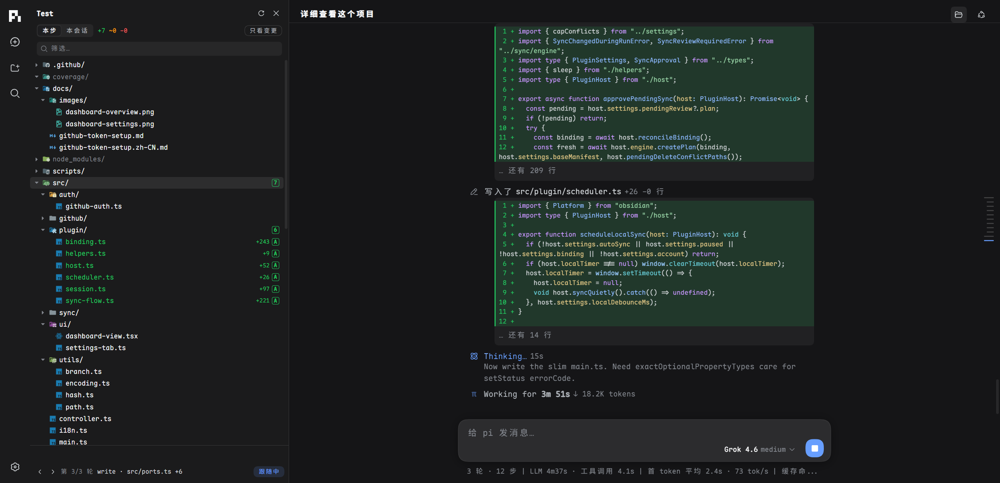</p>
<p align="center">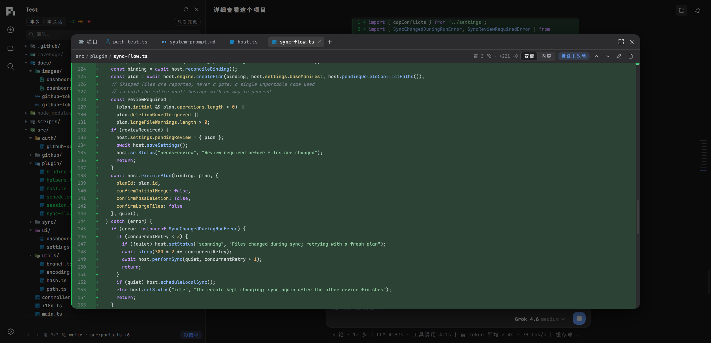</p>

### 文件查看器

项目文件在页面里打开：多标签，`+` 用来找文件。同一个文件可以看变更（整文件 diff，跳到上一处或下一处）、内容（行号和语法高亮；被删的文件显示删除前）或渲染（Markdown）。选中的片段可以引用进输入框，也可以用本地编辑器打开。

<p align="center">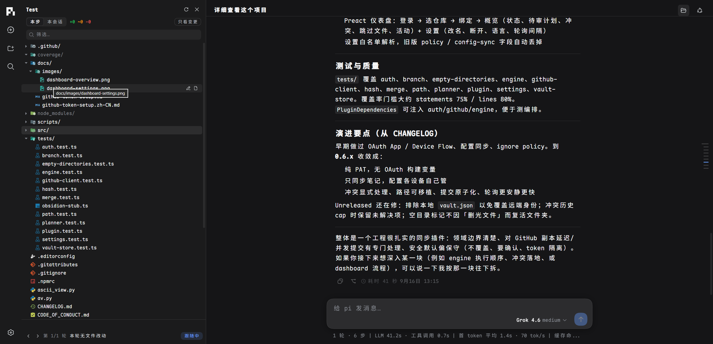</p>
<p align="center">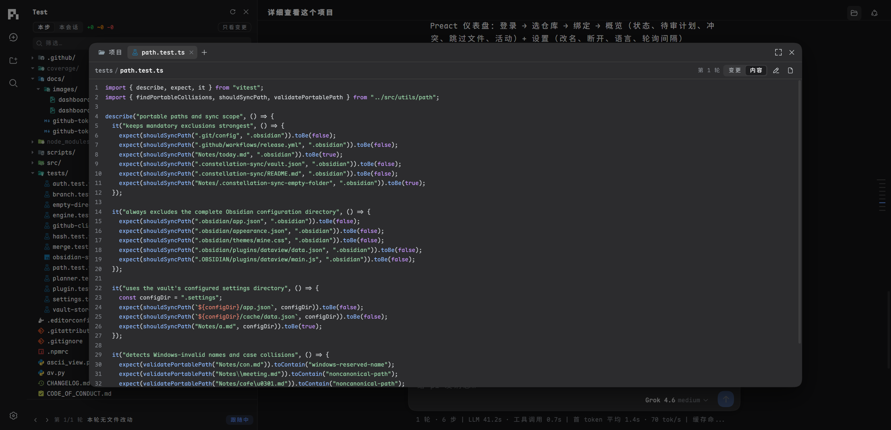</p>

### 上下文计量

点输入框旁的圆环，上下文窗口按段展开：系统提示词、工具、Memory（AGENTS.md）、技能、各类消息、压缩后的内容、自动压缩预留和剩余空间。数字是按字符估算的。

### 模型与供应商

内置 30 多家提供方，用 API Key 或 OAuth（Claude、Codex、Copilot 等）。自定义提供方写入 `models.json`。自定义模型可以声明能否思考、开放哪些档位、每一档发给接口的值，以及能否看图。思考强度用 pi 内置的档位；新会话从 pi 自己的 `settings.json` 里的默认模型和默认强度开始，和终端里的 pi 共用。

<p align="center">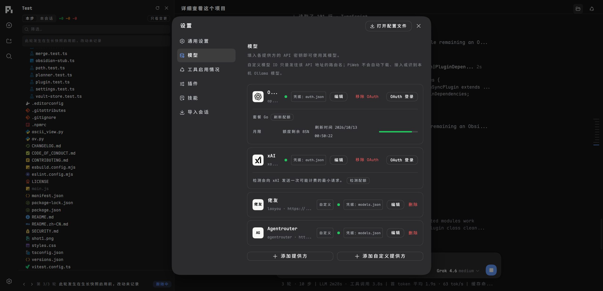</p>
<p align="center">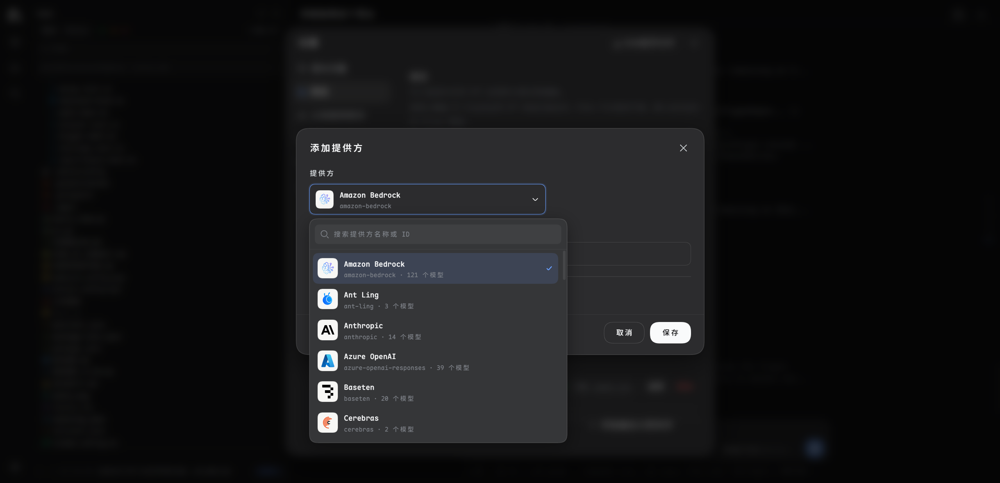</p>
<p align="center">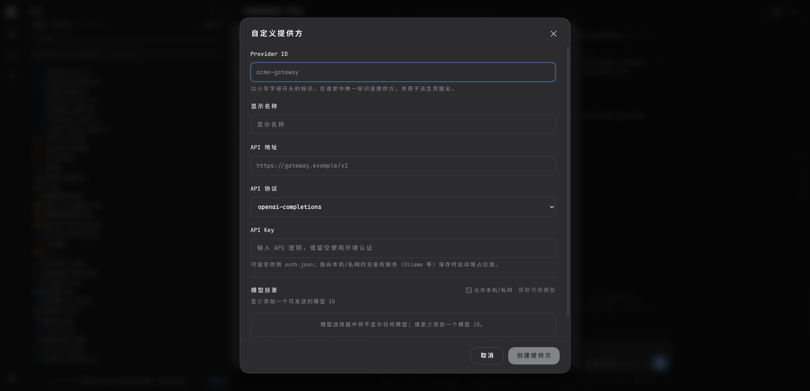</p>

### 插件与技能

用 Pi 自带的包管理器安装、更新、卸载扩展。技能可以启用、禁用或删除，单文件技能只删这个文件。

### pi 的眼睛

本机有 Chrome、Edge 或 Chromium 时，pi 多出 `browser_open`、`browser_screenshot`、`browser_console`、`browser_click`、`browser_type`。它在无头浏览器里打开你的开发服务器，看截图（不能看图的模型改为看页面文本大纲），读控制台报错和失败请求，然后接着改。截图出现在对话里。点截图上的「选元素」，再点页面上的一块，它就作为芯片进输入框，带 DOM 路径和源码位置；模型能看图时还附上这块的裁剪图。

### 安全防护

可以用 `PI_WEB_PASSWORD` 打开登录页，API 仍接受用户名 `pi` 的 HTTP Basic。连续输错会限速。写请求要过同源检查，路径不能越出工作区和会话目录。工具预设（只读 / 工作区写入 / 完全访问）只限制智能体能用哪些工具，不是操作系统沙箱。

## 快速开始

**环境要求**：Node.js ≥ 22.19.0（推荐 Node.js 24）；Git 与生长树功能还需要安装 Git。生长记录直接存在工作区自己的 `.git` 中：非 Git 目录会在首次提交前自动 `git init`，每轮一个 commit，挂在专用引用 `refs/piweb/rounds/<key>` 下，不触碰你的分支、HEAD 与暂存区。可选：pi 的浏览器工具需要 Chrome / Edge / Chromium（Windows 自带 Edge）。

### 通过 npm 全局安装（推荐）

```bash
npm install -g @rexvane/piweb
piweb
```

全局安装会在安装时（或首次运行时）准备一次生产产物，随后以生产模式启动；失败时会明确报错而不是回退到缺少开发依赖的开发模式，可用 `npm rebuild -g @rexvane/piweb` 重试。包只注册 `piweb` 一个命令，与官方 `pi` CLI（`npm i -g @earendil-works/pi-coding-agent`）互不冲突，可以同时安装。

更新 npm 安装：先停止 `piweb`，运行 `npm install -g @rexvane/piweb@latest`，再重新启动；有新版本时，设置 → 通用设置 → PiWeb 版本旁的“检查更新”会显示这条命令。npm 会替换整个安装目录，不要在 `piweb` 运行时更新。pi 引擎由每个 PiWeb 发布版本固定，随 PiWeb 一起更新。

### 在本仓库中开发

```bash
npm install
npm run dev        # 热重载开发服务器
```

或在本地跑生产构建：

```bash
npm install
npm run build      # 或：npm run build:release（独立目录，不影响正在运行的构建）
npm start          # 默认 http://127.0.0.1:30141（端口占用自动 +1）
```

### 命令行参数（bin/piweb.js）

```
-p, --port <port>      监听端口（默认 30141，env PORT；被占用自动 +1）
-H, --hostname <host>  绑定地址（默认 127.0.0.1，env PI_WEB_HOSTNAME）
--dev                  以开发模式启动（`next dev`；env PI_WEB_DEV=1；没有生产构建时也会自动走此模式）
--no-open              不自动打开浏览器（env PI_WEB_NO_OPEN=1）
-h, --help             帮助信息
```

环境变量：`PI_WEB_PASSWORD` 开启浏览器登录会话，并为 API 客户端保留 HTTP Basic Auth（用户名 `pi`）；生产模式绑定非本机地址时**必须**设置。输错密码按整个服务限速：新的错误密码满 10 个后，每 30 秒只能再试一次，已登录的浏览器不受影响。开发模式仅允许本机回环地址，即使设置密码也不能对外监听；没有生产构建时，对外启动会明确失败，不会自动暴露开发服务器。远程访问请使用 HTTPS 或可信 VPN。`PI_WEB_EDITOR` 指定「用编辑器打开」使用的编辑器（默认 `code`）。`PI_WEB_BROWSER` 为 pi 的浏览器工具指定 Chrome / Edge / Chromium 可执行文件（默认自动查找）；浏览器工具默认只打开本机与内网地址，设置 `PI_WEB_BROWSER_ALLOW_PUBLIC=1` 才放开公网。未设密码时只接受 `Host` 为本机回环地址的请求。

`GET /api/health` 仅公开固定服务标识，让启动器无需向未知端口发送凭据。版本信息改由需要认证的 `/api/version` 返回。工具预设限制的是智能体可用工具，不是操作系统沙箱；已安装扩展使用服务进程本身的权限运行。

模型目录探测默认拒绝回环、私网及保留网段地址。如果确实使用本地模型网关，可在启动 PiWeb 前设置 `PI_WEB_ALLOW_PRIVATE_MODEL_DISCOVERY=1`。此开关只放宽模型目录探测，请仅在可信的 PiWeb 实例上使用。

### 用 git 查看生长历史

每一轮都是普通的 git commit，任何 git 工具都能看：

```bash
git for-each-ref refs/piweb/rounds/        # 本工作区的引用（每个 worktree 一条）
git log --stat refs/piweb/rounds/<key>      # 每轮一个 commit：标题是你的提问，Piweb-* trailers 记会话与状态
```

按轮记录之前的版本在 `refs/piweb/growth/` 下按工具步存快照，另有 `.git/piweb/ledger.jsonl` 账本；当前版本不再读取它们。清理方法：

```bash
git for-each-ref --format="delete %(refname)" refs/piweb/growth/ | git update-ref --stdin
rm .git/piweb/ledger.jsonl
```

### 开发与测试

```bash
npm run dev        # 启动热重载开发服务器
npm run typecheck  # TypeScript 类型检查
npm test           # 服务、协议和组件回归测试
npm run check      # 完整流水线校验（类型 + 测试 + 生产构建）
npm run build:release # 校验并准备独立生产构建，不覆盖运行中的构建
```

## 状态与已知限制（2026-10-07）

审查后的修复已合入本分支并完成一次隔离发布与本地生产部署：登录页生产构建、经过 Next.js 代理的上传完整性、扩展运行时按会话隔离与重载后的工具权限、模型及设置的无损写入、输入草稿与扩展待答界面的生命周期、Git/Growth/diff 正确性，以及隔离发布构建。

此后新增了在 pi 的浏览器截图上选元素、思考强度跟随 pi 自己的模型设置、已发消息可编辑重发或撤回；删除技能改为按 pi 的技能形态处理（单文件技能只删这个文件），npm 安装能正确完成首次构建和检查更新，密码校验加了防爆破限速。在设置里保存模型配置后，已打开的会话立即用上新定义；回答在生成过程中就按 Markdown 排版；内置提供方的覆盖删空后整块移除（以前会写出 pi 判为无效的空块，保存失败）。

最近一次验证：本机（Windows）TypeScript 检查通过，**79 个测试文件中 496 项通过、1 项跳过**（需要符号链接权限的生长记录测试；Linux 上跳过的是仅 Windows 运行的 PowerShell 编码测试）；CI 在 Linux、Windows 与 Node.js 22.19.0、24 上跑完整流水线（类型、测试、生产构建）均通过。真实浏览器测试需要 Chrome / Edge / Chromium，没有时跳过。

已知限制：模型配置保存会规范化为标准 JSON（注释格式不保留，数据保留）；更新在维护窗口内原地更新依赖，不是零停机；自定义工具白名单只存在于会话生命周期内；不隔离第三方扩展模块的全局变量。编辑重发或撤回已发消息只回退对话，不回退智能体已经改过的文件（文件请用生长历史找回）。密码限速是整个服务一份额度，有人持续乱试时，所有人用密码登录都要等（已登录的浏览器不受影响）。拖进输入框的非图片文件保存在 `~/.pi/agent/web-uploads/`，会话按路径引用它们，所以不会自动清理，需要时请手动删除旧文件。生长记录：同一工作区两个会话同时运行时，改动可能串到对方的轮里；一轮之内用 shell 命令做的改动只能看到本轮汇总（edit/write 的逐次 diff 仍在对话里）。浏览器工具只在 Workspace Write 和 Full access 两种工具预设下提供；无头浏览器用临时 profile，PiWeb 重启后需要在被测应用里重新登录；截图和其他图片一样存进会话 JSONL；地址策略只阻止工具打开公网地址，不限制页面自己加载的内容。

## 生产构建与更新

PiWeb 正在运行时，请使用 `npm run build:release` 准备新构建。它先校验类型与测试，再将产物写入全新的 `.next-releases/<id>`，全部成功后才发布供下次启动使用的构建记录。它不会重启服务或覆盖现有进程使用的产物。`npm start` 选择最后成功准备的发布构建；发布失败或中断后会明确报错，而不是悄悄回退旧构建。排除错误后重新运行 `npm run build:release` 即可恢复。

界面中的更新使用同一校验流程。源码和 npm 依赖仍在安装目录中更新，因此应在没有智能体运行轮次的维护窗口执行。这不是依赖完全隔离的零停机发布系统。成功更新后由用户手动重启 PiWeb；运行中的进程不会自动切换构建。以上适用于 Git 仓库安装；npm 安装的更新只对照 registry 并显示 npm 命令（见“通过 npm 全局安装”）。

CI 在 Linux、Windows 与 Node.js 22.19.0、24 上执行完整检查。普通 `npm run build` 仍使用 `.next`；若生产进程正在使用该目录，不要直接覆盖构建。

## 架构

```
浏览器 (React 19 + Tailwind, src/components)
   │  REST 命令 (POST /api/agent/[id]) + SSE 事件流 (GET /api/agent/[id]/events)
   ▼
Next.js 服务端 (src/app/api, src/lib)
   ├─ agent-manager    AgentSession 池：惰性冷启动、事件翻译、空闲回收（10min/最多 6）
   ├─ session-reader   直读 ~/.pi/agent/sessions/**.jsonl（冷渲染不开 agent）
   ├─ trajectory       轨迹账本 + 服务端计时（TTFT/decode）
   ├─ skills/prompts   技能与 Prompt 模板发现 + SKILL.md frontmatter 开关
   ├─ models-service   模型目录/认证/OAuth 桥/models.json
   ├─ security-service 工具预设 + 项目信任
   ├─ plugins-service  pi 包安装/卸载/更新（DefaultPackageManager）+ 扩展清单
   ├─ workspace-store  手动添加的工作区（web-workspaces.json）+ 原生选文件夹
   ├─ growth-*         项目生长：每轮一个 commit 挂在 refs/piweb/rounds/<key>，时间轴由 git log 读回
   ├─ browser/*        pi 的眼睛：无头 Chrome / Edge 走 CDP 管道，浏览器工具与截图
   ▼
@earendil-works/pi-coding-agent  (官方 SDK，pi 未修改)
```

## 开源协议

[MIT License](LICENSE)
